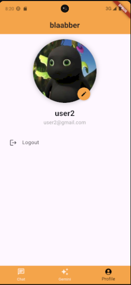

# 💬 Blaabber

**Blaabber** adalah aplikasi percakapan yang memungkinkan pengguna untuk:
- Berkomunikasi secara pribadi dan dalam group
- Mengelola kontak dan group
- Berinteraksi dengan **model bahasa AI Gemini**

---
## 👥 Anggota Tim

**Kelompok 1 FP Pemrograman Perangkat Bergerak C**

| NRP         | Nama                          |
|-------------|-------------------------------|
| 5025211102  | Adhira Riyanti Amanda         |
| 5025221187  | Fatiya Izzati                 |
| 5025221211  | Muhammad Ihsan Al Khwaritsmi  |

---

## ✨ Fitur-Fitur

### 🔐 Authentication
- **Register**: menggunakan email, username, dan password
- **Login**: menggunakan email dan password
- **Logout**
- **Profile Picture** dengan:
  - **Menambahkan foto profil** dengan mengambil dari gallery atau camera
  - **Mengubah foto profil** dengan mengambil dari gallery atau camera
  - **Menghapus foto profil**

### 👥 Contact
- **Create/Add contact** dengan:
  - **Tambah kontak**: pengguna memasukkan username dan nama kontak yang akan disimpan
  - **Auto search**: jika username not found atau sudah disimpan maka akan gagal
  - **Auto add**: contact pengguna yang tersimpan akan otomatis menampilkan roomchat walaupun belum menyimpan kontak penyimpan
- **Edit contact**: mengubah nama kontak
- **Delete contact** dengan:
  - menghapus kontak, aksi ini akan sekaligus menghilangkan private room chat
  - jika setelah menghapus kontak, pengguna menambahkan kontak kembali, maka roomchat lama akan kembali

### 👨‍👩‍👧‍👦 Group
- **Create group** dengan:
  - **Add nama group**
  - **Add member dan admin**
  - **Filter pencarian kontak** untuk dijadikan member
- **Update group** (khusus admin):
  - **Update nama group dan profile picture group**
  - **Add dan remove member dan admin**
- **Leave group**:
    - Apabila user merupakan satu-satunya admin di group, sistem akan otomatis menunjuk admin baru dari member group secara random.
- **Delete group** (khusus admin)
- **Halaman detail group**:
  - **View nama group dan profile picture group**
  - **View daftar member dan admin**

### 💬 Chat Room
-  **Send Chat (Create ChatMessage)** dengan:
    - **Input Text di textfield**
    - **Tekan tombol Send**
- **Edit Message** dengan:
    - **Menekan salah satu ChatMessage dengan lama**
    - **Lalu Input sesuai perbaikan yang dikehendaki**
- **Delete Message** dengan:
    - **menekan salah satu ChatMessage dengan lama**
    - **tekan tombol delete pada dialog yang keluar**
- **Menampilkan semua ChatMessage dari semua akun yang terhubung**
    - **View nama sender**
    - **View message yang telah diedit**

---

## 📸 Screenshot

### 🧩 Splash and Auth

  
  
  

---

### 🏠 Home Page

  

---

### 📂 Group & Contact

  
  
  
  

---

### ✉️ Chat Interface

  
  
  
  

## 🚀 Teknologi yang Digunakan
- **Firebase** (Authentication dan Firestore)
- **Gemini API** (untuk AI Chat)

---

## 🧑‍🤝‍🧑 Kontribusi

| Nama             | Kontribusi                                                                 |
|------------------|----------------------------------------------------------------------------|
| Adhira Riyanti Amanda   |  |
| Fatiya Izzati  |  |
| Muhammad Ihsan Al Khwaritsmi     |            |

---
